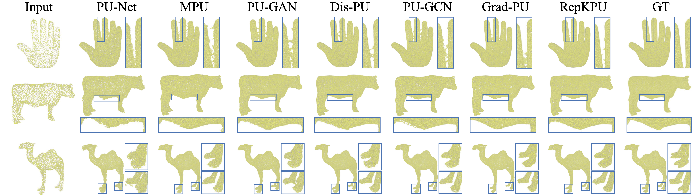

<div align='center'>
<h1>(CVPR'24) Point Cloud Upsampling with Kernel Point Representation and Deformation</h1>
</div>

 

##  Installation 
Step1. Install requirements:
```
python == 3.6.13
torch == 1.10.1
CUDA == 12.2
numpy == 1.19.5
open3d == 0.9.0.0
einops ==0.4.1
scikit-learn==1.0.1
tqdm==4.64.0
h5py==3.1.0
```
Step2. Compile the C++ extension modules:
```
cd models/Chamfer3D
python setup.py install
cd ../pointops
python setup.py install
```


##  Data preparation 

Datasets can be download from here:

| original PU-GAN | PU1K | pre-processed PU-GAN |
|:-------------:|:---------------:|:-------------:| 
|  [here](https://github.com/liruihui/PU-GAN) | [here](https://github.com/guochengqian/PU-GCN) | [Google Drive](https://drive.google.com/drive/folders/14Rd1jaRvGQHJAWM7q_FgJiL9U8_M30qf?usp=drive_link)  |


* We provide a pre-processed PU-GAN testing set with multiple resolutions of GT point clouds.
* If you want to generate testing point clouds from mesh files by youself, please refer to [here](https://github.com/yunhe20/Grad-PU).

After data preparation, the overall directory structure should be:
```
│data/
├──PU-GAN/
│   ├──train/
│   ├──test/
│   │   ├──pugan_4x
│   │   ├──pugan_16x
│   │   ├──arbitrary_scale
│   │   ├──.......
├──PU1K/
│   ├──train/
│   ├──test/
```

##   Training 


Training models on PU-GAN (or PU1K) dataset:
```
python train.py --dataset pugan
```
or
```
python train.py --dataset pu1k
```
Results will be saved under ./output


##  Testing & Evaluation

We provide several pre-trained weights:

| dataset  | weight | config | 
| --- | --- | --- |
|PU-GAN |  [Google Drive](https://drive.google.com/drive/folders/1Iv2pPePqDXRSiDalrFiDDtJ4WiseCdhZ?usp=drive_link)| [here](https://github.com/EasyRy/RepKPU/blob/main/cfgs/upsampling/pugan_args.py)|
|PU1K | [Google Drive](https://drive.google.com/drive/folders/1IPQJdiwGMSympYFqrnRIhFVTh096vEQc?usp=drive_link)| [here](https://github.com/EasyRy/RepKPU/blob/main/cfgs/upsampling/pu1k_args.py)|
|PU-GAN * |  [Google Drive](https://drive.google.com/drive/folders/1ovbv8edja9o8900bQtb2Md7jEXt4LorL?usp=drive_link)| [here](https://github.com/EasyRy/RepKPU/blob/main/cfgs/upsampling/pugan_paper_args.py)|

\* indicates the origin model used in our paper

#### Testing example:
```
# 4X upsampling on PU-GAN dataset
python test.py --dataset pugan --input_dir ./data/PU-GAN/test/pugan_4x/input --gt_dir ./data/PU-GAN/test/pugan_4x/gt --ckpt ./pretrain/pugan_best.pth  --r 4 --save_dir ./result/pugan_4x

# 16X upsampling on PU-GAN dataset
python test.py --dataset pugan --input_dir ./data/PU-GAN/test/pugan_16x/input --gt_dir ./data/PU-GAN/test/pugan_16x/gt --ckpt ./pretrain/pugan_best.pth  --r 16 --save_dir ./result/pugan_16x

# 4X upsampling on PU1K dataset
python test.py --dataset pu1k --input_dir ./data/PU1K/test/input_2048/input_2048/ --gt_dir ./data/PU1K/test/input_2048/gt_8192/ --ckpt ./pretrain/pu1k_best.pth  --r 4 --save_dir ./result/pu1k_4x

# arbitrary-scale upsampling on PU-GAN dataset, take 19x for example
python test.py --dataset pugan --input_dir ./data/PU-GAN/test/arbitrary_scale/19x/input --gt_dir ./data/PU-GAN/test/arbitrary_scale/19x/gt --ckpt ./pretrain/pugan_best.pth  --r 19 --save_dir ./result/pugan_19x --flexible
```
* Don't miss "--flexible" for arbitrary-scale upsampling.
* If you want to use our original model, please use "--o", like:
```
python test.py --dataset pugan --input_dir ./data/PU-GAN/test/pugan_4x/input --gt_dir ./data/PU-GAN/test/pugan_4x/gt --ckpt ./pretrain/pugan_o_best.pth  --r 4 --save_dir ./result/pugan_4x --o
```
* You can use our code to get CD value. To calculate HD and P2F value, please refer to [here](https://github.com/guochengqian/PU-GCN). 

#### Surface reconstruction:
```
python surf_recon.py --file_path xxx.xyz --save_path xxx.obj
```
* [Here](https://drive.google.com/drive/folders/1F62lEPTdMkv99v_1NAD78xvvIVzVhhg5?usp=drive_link), we provide an example point cloud and reconstructed result.
## Acknowledgements
This repo is heavily based on [KPConv](https://github.com/HuguesTHOMAS/KPConv-PyTorch), [Grad-PU](https://github.com/yunhe20/Grad-PU/), [PU-GCN](https://github.com/guochengqian/PU-GCN), [PU-GAN](https://github.com/liruihui/PU-GAN). Thanks for their great work!

## Citation
```
@inproceedings{rong2024repkpu,
  title={RepKPU: Point Cloud Upsampling with Kernel Point Representation and Deformation},
  author={Rong, Yi and Zhou, Haoran and Xia, Kang and Mei, Cheng and Wang, Jiahao and Lu, Tong},
  booktitle={Proceedings of the IEEE/CVF Conference on Computer Vision and Pattern Recognition},
  pages={21050--21060},
  year={2024}
}
```
